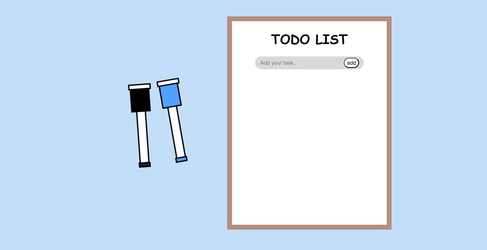
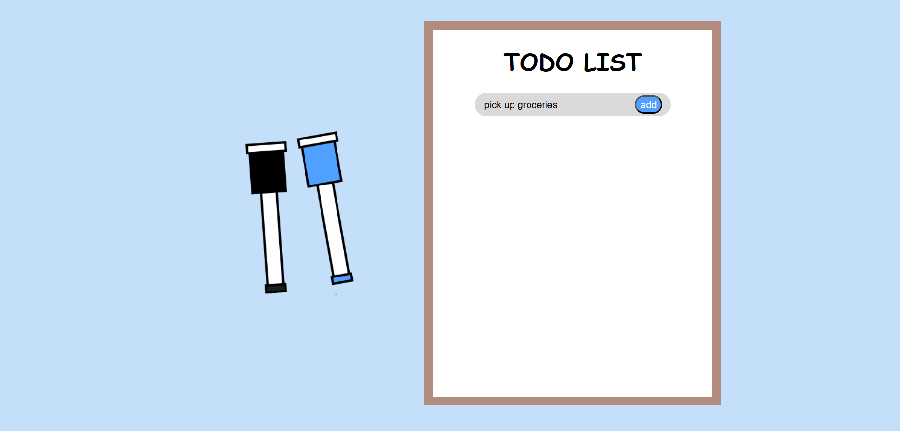
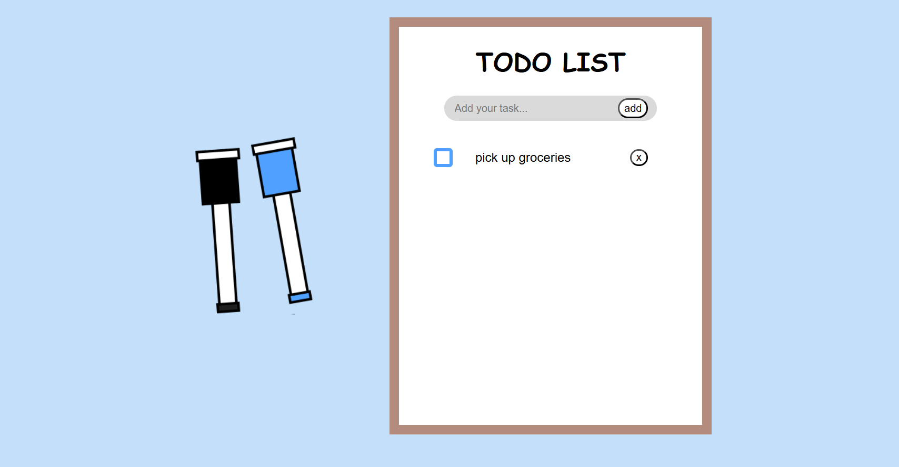
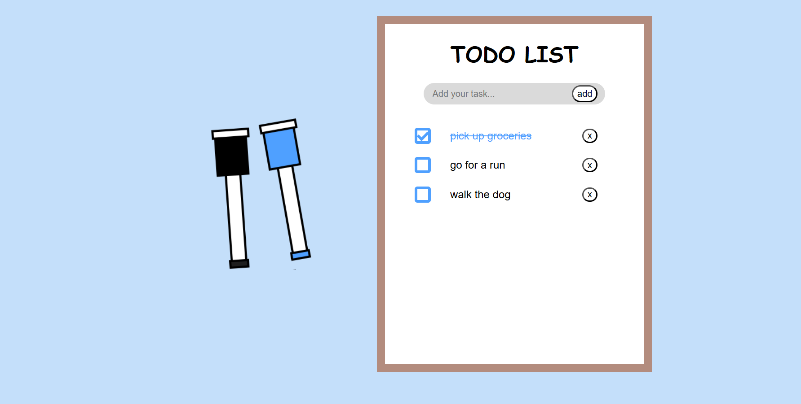
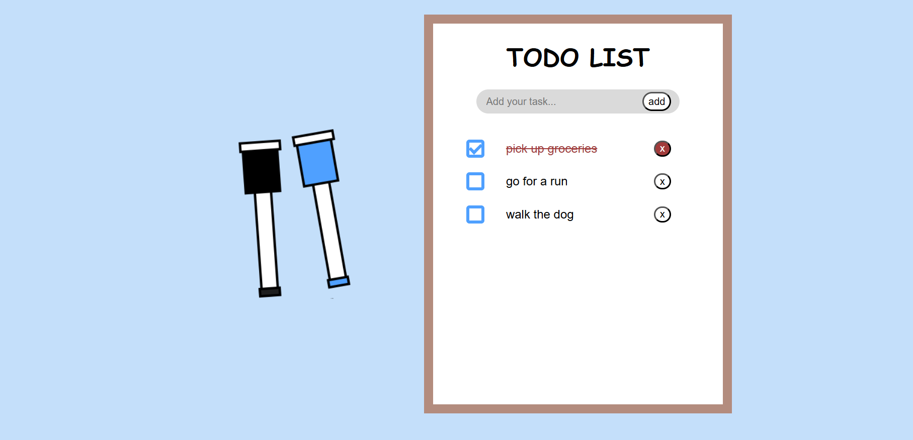
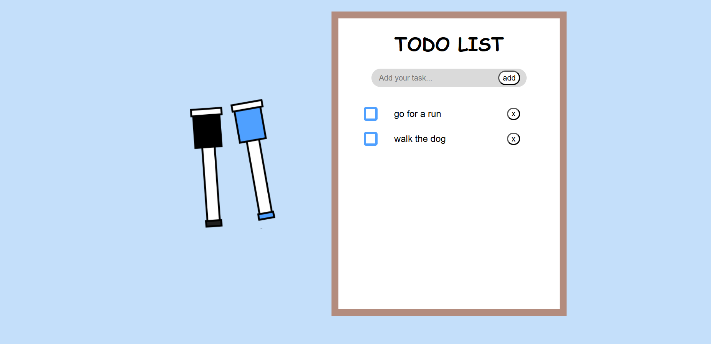

# ToDo List App
A simple task-management app built with React, TypeScript, and Vite. Designed to practice front-end development.

# Features
+ Add, delete, and mark tasks as complete
+ Clean, minimal UI

# Tech Stack
+ React
+ TypeScript
+ Vite
+ CSS

# What I Learned 
+ How to build small projects using React and TypeScript, and how the two work together
+ How to create reusable UI components and how to manage state with React hooks

# Screenshots
## Website layout

## Adding a task
<figure>
    
    <figcaption>Add tasks by typing them into the form and clicking the add button! </figcaption>
</figure>
<figure>
    
    <figcaption>Then the task appears on the whiteboard area. </figcaption>
</figure>

## Marking a task as completed
<figure>
    
    <figcaption>Click the checkbox beside a task to mark it as completed. </figcaption>
</figure>

## Deleting a task
<figure>
    
    <figcaption>Click the red button with an 'x' next to a task to delete it! </figcaption>
</figure>

<figure>
    
    <figcaption>Afterwards the task will be removed from the whiteboard area. </figcaption>
</figure>
 